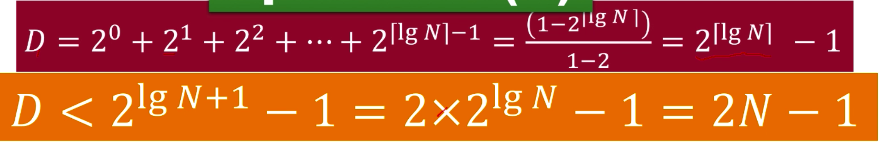

## 思路梳理
- 1、将数组拆分成两部分
- 2、分别排序拆分好的部分
- 3、合并两个拍好序的数组
- 4、递归上边的步骤

## 复杂度分析

### 拆分
- 用树状图来分析
第一层拆分 2 ** 0
第二层拆分 2 ** 1
第三层拆分 2 ** 2
第四层拆分 2 ** 3
...
第n层拆分 2 ** (lgn向上取整)] (lgn即为树的高度)

将每层的拆分加和：

```js
// 最下边一层已经不需要拆分了，所以最后一项应该 2 ** (lgn - 1)
// 从左往右看为等比数列求和，所以套公式(s = a1(1 - q ** n) / 1 - q)得出结果

```

### 合并
同理还是树状图来分析
- 合并一层需要的时间为N，因为每一层所有项数量的和都是N项
- 需要合并的层数为 lgN 层
- 所有合并的结果应为 N * lgN


### 总和
拆分 + 合并的总和即为 mergeSort 的总耗费时间
On + Onlgn = Onlgn